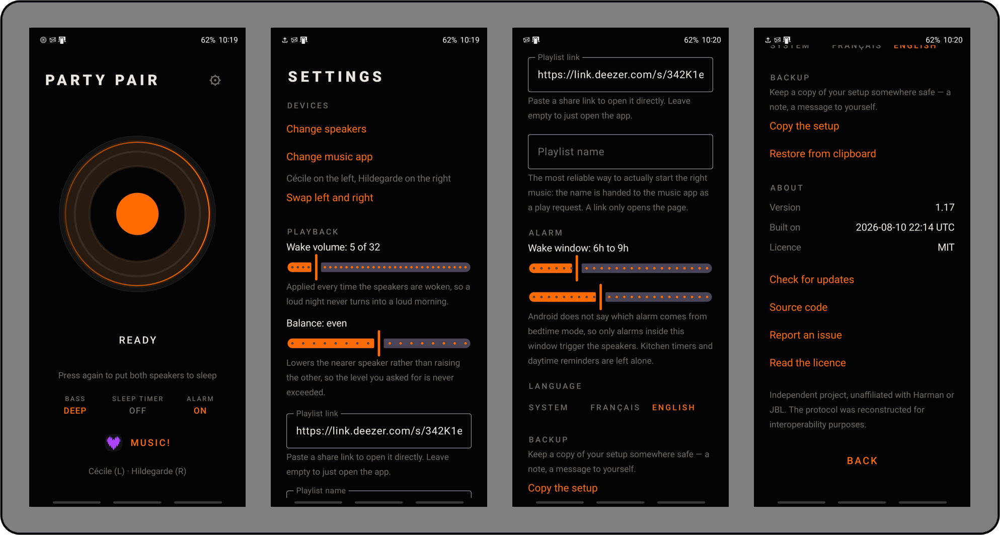

# Party Pair

Wakes two JBL PartyBox speakers and links them in wireless stereo, with one tap.



The official app takes a dozen steps to rebuild the stereo link, which does not survive switching the speakers off. This one does it in a single gesture — and can do it on its own.

The interface follows your phone's language: **Party Pair** in English, **Boîte de Fête** in French.

*[Version française du README](README.fr.md)*

## What it does

- **One button**: wakes both speakers, rebuilds the stereo link, connects the audio. A second tap puts them back to sleep, fading the sound out first.
- **Wake-up**: the speakers switch on ahead of your alarm and start your playlist.
- **Sleep timer**: delayed shutdown, with a countdown in your notifications.
- **Bass, volume, balance** between the two speakers, left and right channels.
- **Widget, quick-settings tile and shortcuts** for Samsung routines and Home Assistant.

## Install

Not on any app store: download the APK from the [releases page](https://github.com/louim-lbs/PartyPair/releases/latest), open it on your phone, and allow installation from that source.

Prefer to build it yourself? See [docs/BUILDING.md](docs/BUILDING.md).

## First run

1. **Pair your speakers in stereo once, using the official JBL app.** This is the only step Party Pair cannot do for you; from then on it rebuilds the link by itself.
2. Open Party Pair and grant Bluetooth access.
3. Pick the speaker that plays the sound, then the one that joins it. The second one does not need to be paired with your phone — better if it isn't.
4. Confirm your phone's Bluetooth address, detected automatically where possible.

That's it. From then on, one tap.

## Hardware

Verified on two **JBL PartyBox 710**, running Android 13.

The protocol should hold across the PartyBox range, but nothing else has been tested. If you try it on another model, [tell us how it went](https://github.com/louim-lbs/PartyPair/issues) — that is what will move this forward.

Android 8 or later. Language selection and per-app language need Android 13.

## Further reading

| | |
|---|---|
| [Automation](docs/AUTOMATION.md) | Samsung routines, Home Assistant, Tasker, wake-up, driving the speakers from a Raspberry Pi |
| [Building](docs/BUILDING.md) | From Windows with VS Code, or locally |
| [The protocol](docs/PROTOCOL.md) | The full reverse engineering of the PartyBox BLE protocol |
| [Security](docs/SECURITY.md) | What the app exposes, asks for, and stores |

## How it works

PartyBox speakers expose a proprietary BLE service — frames of the form `AA <command> <length> <payload>` — documented nowhere. It was reconstructed by cross-referencing Bluetooth HCI captures with a decompilation of the official app. The stereo pairing command is seven bytes:

```
AA 13 04 00 39 01 01
```

Everything is written down in [docs/PROTOCOL.md](docs/PROTOCOL.md): opcode table, fields, verified sequences. It is reusable from any client, Android or otherwise.

## Licence and trademarks

MIT — see [LICENSE](LICENSE).

An independent project, unaffiliated with Harman or JBL. "JBL" and "PartyBox" are trademarks of Harman International Industries; no brand artwork is used here. The protocol was reconstructed for interoperability, on hardware the author owns.
